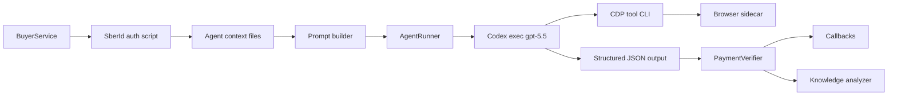
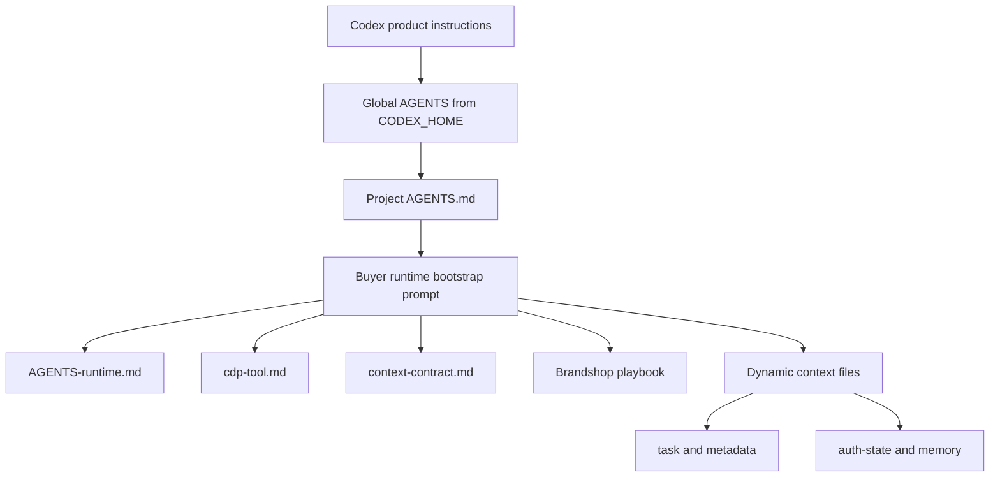

# Анализ агентского сценария Brandshop от 2026-05-01

## Статус документа

Документ фиксирует разбор одного фактического прогона `buyer` по Brandshop из локальных trace-артефактов `.tmp`, а также рекомендации по сокращению количества агентских шагов, улучшению prompt-инструкций и трассировки. Это аналитический документ, не runtime-контракт.

Анализ подготовлен с использованием трех независимых read-only субагентов:

| Срез | Что проверялось |
| --- | --- |
| Метрики trace | Количество browser-action записей, CDP-команд, idle gaps, retry behavior, объем артефактов. |
| Prompt/playbook | `AGENTS.md`, runtime prompt, `docs/buyer-agent/*`, Brandshop playbook и правила CDP tool. |
| Runner/tracing | `buyer/app/runner.py`, `buyer/tools/cdp_tool.py`, schema structured output и callback trace summary. |

## Источники

Локальные источники:

- `.tmp/buyer-observability/2026-05-01/12-38-06/a1e45b6a-6a64-4b35-9832-b4625018db28/`
- `buyer/app/runner.py`
- `buyer/app/prompt_builder.py`
- `buyer/app/settings.py`
- `buyer/app/codex_output_schema.json`
- `buyer/tools/cdp_tool.py`
- `docs/buyer-agent/AGENTS-runtime.md`
- `docs/buyer-agent/cdp-tool.md`
- `docs/buyer-agent/context-contract.md`
- `docs/buyer-agent/playbooks/brandshop.md`
- `AGENTS.md`

Официальные источники OpenAI:

- [Using GPT-5.5](https://developers.openai.com/api/docs/guides/latest-model)
- [GPT-5.5 Prompt guidance](https://developers.openai.com/api/docs/guides/prompt-guidance?model=gpt-5.5)
- [Introducing GPT-5.5](https://openai.com/index/introducing-gpt-5-5/)
- [Prompting - Codex](https://developers.openai.com/codex/prompting)
- [Custom instructions with AGENTS.md - Codex](https://developers.openai.com/codex/guides/agents-md)
- [GPT-5-Codex Prompting Guide](https://cookbook.openai.com/examples/gpt-5-codex_prompting_guide)

## Краткий вывод

В этом локальном trace нет подтверждения 107 browser/action шагов. Зафиксировано `browser_actions_total=84`, но это счетчик JSONL-событий, а не человекопонятных шагов покупки. В этих 84 строках:

| Тип записи | Количество |
| --- | ---: |
| `browser_command_started` | 28 |
| `browser_page_selected` | 28 |
| `browser_command_finished` | 27 |
| `browser_command_failed` | 1 |

Фактически было около 28 CDP-команд, из них 27 завершились успешно и 1 `snapshot` упал на strict mode. Даже 28 команд можно сократить: для такого Brandshop-сценария разумная цель после auth - примерно 10-14 CDP-команд, если разрешить прямой search URL, ограничить проверки milestone-ами и добавить `wait-url`/`wait-selector`.

Главная проблема не в скорости браузера. Из `245.1s` общего времени шага:

| Метрика | Значение | Доля от шага |
| --- | ---: | ---: |
| Общая длительность `AgentRunner.run_step()` | `245094ms` | `100%` |
| Суммарная длительность browser commands | `23743ms` | `9.7%` |
| Browser busy union | `23757ms` | `9.7%` |
| Inter-command idle | `216548ms` | `88.3%` |
| Post-browser idle | `5750ms` | `2.3%` |

То есть сокращать нужно прежде всего агентское размышление между командами, retry-петлю и избыточное наблюдение страницы, а не только Playwright/CDP latency.

## Фактический сценарий

Прогон:

| Поле | Значение |
| --- | --- |
| Session | `a1e45b6a-6a64-4b35-9832-b4625018db28` |
| Trace root | `.tmp/buyer-observability/2026-05-01/12-38-06/...` |
| Task | `купи светлые кроссовки Jordan Air High` |
| Metadata | `city=Москва`, `size=45 EU` |
| Start URL | `https://brandshop.ru` |
| Auth state | `authenticated=true`, `provider=sberid`, `script_status=completed` |
| Final payment boundary | `https://yoomoney.ru/checkout/payments/v2/contract?orderId=3186b36d-000f-5001-8000-1d3d9682dead` |
| Итоговый provider host | `yoomoney.ru` |

Важно: размер `45 EU` в этом прогоне был не в тексте `task`, а в `metadata.json`. Для агента это все равно обязательный constraint: Brandshop playbook прямо делает размер из task, metadata или latest user reply обязательным, а `context-contract` относит metadata к предпочтениям и устойчивым ограничениям.

## Архитектура текущего выполнения



Текущий generic-agent не вызывает Playwright напрямую из модели. Он получает shell-доступ к `buyer/tools/cdp_tool.py`, а уже этот CLI управляет browser sidecar через CDP/Playwright. Такой слой дает:

- единое логирование `browser_command_started/finished/failed`;
- recovery-window и выбор активной страницы;
- централизованную sanitize-логику для snapshot/html/text;
- меньше свободы модели генерировать произвольный Playwright-код в рантайме.

Цена этой архитектуры:

- каждый CDP-вызов - отдельный CLI-процесс;
- при каждом вызове появляется `browser_page_selected`;
- нет stateful tool session между командами;
- пока нет `wait-url`/`wait-selector`, поэтому агент использует фиксированные `wait`;
- модель тратит больше времени на выбор следующего shell-вызова, чем браузер на сам вызов.

## Step-by-step фактического прогона

### 0. Auth preparation

Brandshop auth script сработал до generic-agent шага. В `auth-state.json` зафиксировано:

- `authenticated=true`;
- `provider=sberid`;
- `path=script`;
- `attempts=1`;
- `reason_code=auth_ok`;
- `domain=brandshop.ru`.

По trace auth был не полностью лишним: первый переход на `/account/` показал, что Brandshop еще не залогинен и редиректит на `/login/`. После SberId лог содержит промежуточный navigation finish на `/login/`, а затем `auth_verify_account` уже видит `/account/` и подтверждает login markers. Улучшение тут не в удалении финальной проверки account-state, а в более умном preflight: если есть только Sber cookies и нет Brandshop session markers, можно не делать первый account probe, а сразу идти в auth entrypoint.

### 1. Generic-agent запуск

`AgentRunner` собрал prompt и dynamic context:

- `step-001-prompt.txt`;
- `step-001/task.json`;
- `step-001/metadata.json`;
- `step-001/auth-state.json`;
- `step-001/memory.json`;
- `step-001/latest-user-reply.md`;
- `step-001/user-profile.md`.

Prompt требует прочитать stable instruction files:

- `/workspace/docs/buyer-agent/AGENTS-runtime.md`;
- `/workspace/docs/buyer-agent/cdp-tool.md`;
- `/workspace/docs/buyer-agent/context-contract.md`;
- Brandshop playbook.

Параллельно Codex как продукт также читает `AGENTS.md` перед работой. Официальная документация Codex описывает цепочку discovery: global instructions из `CODEX_HOME`, затем project instructions от корня репозитория до cwd, причем более близкие файлы идут позднее и имеют больший приоритет. Это значит, что запуск `codex exec` из `/workspace` может видеть root `AGENTS.md` проекта вместе с runtime prompt. В нашем root `AGENTS.md` есть engineering-процесс правила, полезные для разработки, но шумные для shopping-runtime.

### 2. Codex attempts и retry

Trace показывает:

| Attempt | Model | Duration | Status | Причина |
| --- | --- | ---: | --- | --- |
| `fast` | `gpt-5.5` | `62151ms` | `failed` | `failure_reason=null` |
| `reset_before_same_model` | нет модели | нет duration | `ok=true` | browser reset to `https://brandshop.ru/` |
| `same_model_retry` | `gpt-5.5` | `181305ms` | `completed` | `failure_reason=null` |

Здесь видно два диагностических дефекта:

- `status=failed` при `returncode=0` не объяснен: `failure_reason=null`;
- trace ссылается на `codex-result-step-001-*.json`, но `_run_codex_attempt()` удаляет output file в `finally`, поэтому после прогона structured output нельзя открыть и проверить.

Еще один важный вывод: стратегия указана как `fast_then_strong`, но фактически fast и retry были на одном `gpt-5.5`. По коду `_build_model_attempt_specs()` при совпадении fast и strong возвращает один attempt с ролью `fast`, а затем same-model retry добавляется отдельно при `failed`. Это не дает преимуществ fast/strong fallback, но добавляет дорогой второй проход.

### 3. Browser/CDP commands

Фактическая последовательность CDP-команд:

| # | Команда | Назначение | Итог |
| ---: | --- | --- | --- |
| 1 | `url` | Проверка текущего URL после auth | `/account/` |
| 2 | `goto` | Возврат на главную Brandshop | `/` |
| 3 | `url` | Проверка главной | `/` |
| 4 | `snapshot body` | Поиск search button/input | ok |
| 5 | `click` | Открыть поиск | ok |
| 6 | `fill` | Ввести `Jordan Air High` | ok |
| 7 | `press Enter` | Запустить поиск | ok |
| 8 | `wait 2s` | Дождаться search URL | `/search/?st=Jordan+Air+High` |
| 9 | `snapshot body` | Оценить результаты | ok |
| 10 | `text body` | Прочитать результаты | ok |
| 11 | `links body` | Найти product URL | ok |
| 12 | `snapshot .products, .catalog, main` | Broad selector | failed strict mode |
| 13 | `snapshot .catalog` | Повтор после ошибки | ok |
| 14 | `goto product` | Открыть `goods/510194/ih4363-100/` | ok |
| 15 | `text body` | Проверить продукт | ok |
| 16 | `snapshot body` | Проверить контролы | ok |
| 17 | `html product` | Fallback/доп. проверка | `137717` bytes |
| 18 | `click 45 EU` | Выбрать размер | ok |
| 19 | `text .product-page__card` | Проверить карточку | ok |
| 20 | `click Оформить заказ` | Перейти к checkout | `/checkout/` |
| 21 | `wait 3s` | Дождаться checkout | ok |
| 22 | `text body` | Проверить checkout | ok |
| 23 | `click SberPay` | Выбрать SberPay | ok |
| 24 | `text body` | Повторная проверка checkout | ok |
| 25 | `snapshot body` | Еще проверка checkout | ok |
| 26 | `html checkout` | Fallback/доп. проверка | `455349` bytes |
| 27 | `click confirm` | Создать платежную сессию | ok |
| 28 | `wait 5s` | Дождаться YooMoney | orderId URL |

Ошибка strict selector:

- selector `.products, .catalog, main` матчился одновременно на `<main>` и `.catalog`;
- Playwright strict mode отклонил неоднозначность;
- агент сделал повторный `snapshot .catalog`.

### 4. Payment boundary

После `Подтвердить заказ` браузер перешел на:

`https://yoomoney.ru/checkout/payments/v2/contract?orderId=3186b36d-000f-5001-8000-1d3d9682dead`

Это соответствует Brandshop merchant policy:

- provider host: `yoomoney.ru`;
- evidence source: `brandshop_yoomoney_sberpay_redirect`;
- `orderId` берется из query parameter `orderId`;
- агент должен остановиться на этой границе и не продолжать оплату.

## Почему получилось много шагов

### 1. `browser_actions_total` считает события, а не действия

`runner.py` читает весь JSONL и возвращает `total` как `browser_actions_total`. Но каждая CDP-команда дает минимум:

- `browser_command_started`;
- `browser_page_selected`;
- `browser_command_finished` или `browser_command_failed`.

Поэтому один пользовательский "шаг" превращается в 3 строки. Метрика полезна как размер лога, но плоха как число действий агента.

Рекомендация: переименовать или разделить:

| Новое поле | Смысл |
| --- | --- |
| `browser_events_total` | Все JSONL-записи. |
| `browser_commands_started` | Сколько команд агент реально начал. |
| `browser_commands_finished` | Сколько команд успешно/неуспешно завершились. |
| `browser_commands_failed` | Сколько команд упало. |
| `browser_observation_commands` | `snapshot/text/links/html/url/title/exists/attr`. |
| `browser_mutating_commands` | `goto/click/fill/press`. |

### 2. Prompt требует проверять после каждого state-changing action

`docs/buyer-agent/cdp-tool.md` говорит проверять результат после каждого `click`, `fill` и `press`. Для safety это понятно, но в текущей формулировке правило стало слишком механическим.

Фактический эффект:

- после search: `snapshot`, `text`, `links`, `snapshot`;
- на product: `text`, `snapshot`, `html`, затем после size click еще `text`;
- на checkout: `text`, `click SberPay`, `text`, `snapshot`, `html`, `click confirm`.

Лучше проверять не каждую атомарную команду, а milestone:

| Milestone | Достаточная проверка |
| --- | --- |
| Search result selected | `links`/scoped `text` с product URL, brand/model/color signal. |
| Product ready | scoped `text` или `snapshot` product card: brand/model/size/add-cart or checkout CTA. |
| Checkout ready | scoped `text`: address exists, one item, total, SberPay available. |
| SberPay selected | `exists/attr` для `#pay_sber:checked` или equivalent selected state. |
| Payment boundary | `wait-url`/`url` with `yoomoney.ru/...orderId=...`. |

### 3. HTML fallback слишком легко доступен

`cdp-tool.md` говорит предпочитать structured commands перед `html`, но не задает строгий порог fallback. Поэтому агент сделал два больших HTML dump:

| Страница | Размер |
| --- | ---: |
| Product HTML | `137717` bytes |
| Checkout HTML | `455349` bytes |
| Итого | `593066` bytes |

На checkout это почти наверняка было лишним: уже были `text body`, `click SberPay`, повторный `text body` и `snapshot body`, где видны `SberPay` и `Подтвердить заказ`.

Рекомендация: запретить `html` для обычной проверки product/cart/checkout. Разрешать только если:

- `snapshot/text/exists/attr` не показывают обязательное selected state;
- агент указывает конкретный вопрос, на который должен ответить HTML;
- HTML сохраняется в файл и локально grep-ается узким паттерном;
- полный HTML не печатается в stdout.

### 4. Brandshop playbook ориентирует на UI search, а не direct route

Текущий Brandshop playbook говорит открывать header search button, вводить запрос и нажимать Enter. Поэтому direct URL сейчас нужно считать предлагаемым изменением playbook-а, а не уже разрешенным путем. Для generic-agent это изменение оправдано, если цель - надежно и быстро дойти до SberPay boundary без hardcoded SKU.

В пользовательском ручном сценарии прямой URL после UI search выглядит так:

`https://brandshop.ru/search/?st=Jordan+Air+High`

Для Brandshop можно считать direct search URL допустимым, если:

- он строится только из product identity, а не из hardcoded SKU;
- размер и цвет остаются constraints, а не часть search query;
- после открытия direct URL агент проверяет, что страница действительно Brandshop search result;
- product URL выбирается из результатов, а не захардкожен.

Это убирает минимум 5 команд: `goto home`, `url`, `snapshot`, `click search`, `fill`, `press`, часть фиксированного `wait`.

### 5. Цветовое constraint "светлые" вызывает избыточное исследование

Brandshop playbook требует проверить бренд, модель, категорию, цвет и размер. Для `светлые` это правильно, потому что есть черный и светлый вариант. Но prompt не говорит, когда доказательств достаточно.

Практичное правило:

- если search results показывают два кандидата и один имеет светлую картинку/alt/article/URL/product text, открыть этот candidate;
- если на product page card и image/alt не противоречат light/beige/white constraint, продолжать;
- если два кандидата одинаково plausible и нет текстового/визуального сигнала цвета, вернуть `needs_user_input`.

Нельзя требовать полного HTML или глубокого DOM-inspection просто потому, что constraint назван естественным языком.

### 6. Контекст auth дублируется

`auth-state.json` уже содержит компактный итог авторизации. `memory.json` дополнительно хранит подробный SberId auth summary с registry/artifacts/paths. Для runtime shopping шага это почти не помогает, но добавляет чтение и шум.

Рекомендация: если `auth-state.json.authenticated=true`, в memory оставить только:

- provider;
- domain;
- mode/source/path;
- authenticated;
- reason_code;
- stable markers, если нужны для восстановления.

Не передавать в runtime prompt registry, trace paths, endpoints, artifacts и длинные summaries auth script.

### 7. Retry оказался дорогим и плохо объясненным

Первый `gpt-5.5` attempt занял `62.1s` и вернул `status=failed`, но без `failure_reason`. Затем browser reset и второй `gpt-5.5` attempt занял `181.3s`.

Это указывает на две разные проблемы:

- агентский output schema не имеет diagnostics channel, поэтому модель не может вернуть структурированный blocker/failure_stage/missing_evidence;
- runner удаляет structured output temp files, поэтому нельзя посмотреть, что именно вернул первый attempt.

## Agent-specific анализ

### Как инструкции доходят до внутреннего Codex



По официальной документации Codex, `AGENTS.md` читается до работы и собирается в instruction chain. Для production buyer-agent это важно: root `AGENTS.md` проекта нужен нам как разработчикам, но может быть нерелевантен shopping-runtime агенту. Например, правила про GitHub, PR, docs и developer workflow не помогают купить товар.

Рекомендации:

- запускать runtime `codex exec` из dedicated workdir вне git root, если нужен только shopping prompt;
- если оставаться внутри repo root, помнить, что nested `AGENTS.override.md` может уточнить поздние инструкции, но сам по себе не убирает root `AGENTS.md` из discovery chain;
- держать root `AGENTS.md` как engineering policy, а `docs/buyer-agent/AGENTS-runtime.md` как merchant-runtime policy;
- в trace писать список instruction sources, которые Codex реально загрузил, а не только файлы, которые prompt попросил прочитать.

### GPT-5.5 и почему prompt сейчас провоцирует overwork

Официальные материалы OpenAI по GPT-5.5 описывают модель как сильную для tool-heavy agents, long-context workflows, computer use и coding. В migration guidance отдельно сказано, что GPT-5.5 лучше на outcome-first prompts, а старые process-heavy prompt stacks нужно пересматривать. Также OpenAI рекомендует для tool-heavy/multi-step задач оценивать `low` reasoning перед `none`, а `none` оставлять для latency-critical случаев без сложной цепочки действий.

Сверка с официальными рекомендациями:

| Источник | Релевантный вывод для `buyer` |
| --- | --- |
| [Using GPT-5.5](https://developers.openai.com/api/docs/guides/latest-model) | GPT-5.5 подходит для tool-heavy agents и production workflows, но миграцию стоит начинать с меньшего prompt-а и настраивать reasoning/tool/output параметры по eval-ам. |
| [GPT-5.5 Prompt guidance](https://developers.openai.com/api/docs/guides/prompt-guidance?model=gpt-5.5) | Для GPT-5.5 предпочтительнее outcome-first prompts: цель, success criteria, constraints, evidence и stop rules вместо process-heavy stacks. |
| [Prompting - Codex](https://developers.openai.com/codex/prompting) | Codex работает циклом model/tool calls и дает лучший результат, когда может проверять работу; для `buyer` это означает верификацию milestone-ов, а не бесконечные проверки каждого клика. |
| [Custom instructions with AGENTS.md](https://developers.openai.com/codex/guides/agents-md) | Codex читает `AGENTS.md` до работы и собирает instruction chain; runtime shopping-agent нужно изолировать от developer-only правил root `AGENTS.md`. |
| [GPT-5-Codex Prompting Guide](https://cookbook.openai.com/examples/gpt-5-codex_prompting_guide) | Для Codex-моделей избыточное prompting часто хуже, чем короткие точные инструкции; это совпадает с наблюдаемым overwork в Brandshop trace. |

Текущие настройки `buyer`:

| Setting | Значение |
| --- | --- |
| `codex_model` | `gpt-5.5` |
| `buyer_model_strategy` default | `single` |
| trace model strategy | `fast_then_strong` |
| `codex_reasoning_effort` | `none` |
| `codex_reasoning_summary` | `none` |
| `codex_web_search` | `disabled` |

Для Brandshop shopping-runtime это означает:

- текущие инструкции побуждают модель механически исполнять требование "проверять после каждого click/fill/press", что видно в trace;
- при `reasoning_effort=none` она может тратить меньше reasoning tokens, но все равно делать длинный tool loop из-за prompt constraints;
- отсутствие reasoning summary и per-attempt diagnostics делает долгие idle gaps почти непрозрачными;
- process-heavy playbook может быть хуже, чем короткие outcome-first success criteria с явными stop rules.

Нужно не просто "думать меньше", а дать модели правильный execution budget:

```text
Цель: дойти до YooMoney SberPay boundary и вернуть orderId.
Минимальная проверка: product match, required size, selected SberPay, final orderId URL.
Stop rule: как только final URL содержит yoomoney.ru/...orderId=..., прекрати browser actions и верни JSON.
HTML budget: 0 для обычного пути; 1 только при missing selected-state evidence.
Search budget: 1 search results observation; повтор только если нет matching товара.
```

### Что именно надо изменить в prompt/playbook

| Сейчас | Предлагаемое правило |
| --- | --- |
| Перед действиями прочитай все instruction files. | Передавать resolved runtime packet: краткие правила + relevant Brandshop excerpt + версии/хэши. |
| Проверяй после каждого `click/fill/press`. | Проверяй milestone-и; command result засчитывать как evidence, если он уже содержит нужное состояние. |
| UI search обязателен. | Direct search URL разрешен как fast path; UI search оставить fallback или eval-mode. |
| HTML fallback слабо ограничен. | HTML запрещен на happy path; разрешен только с явной missing-evidence причиной. |
| Cart обязательно открывать после add-to-cart. | Если checkout/cart summary показывает ровно один matching item, size и quantity, отдельное cart popup можно не открывать. |
| Цвет проверяется без критерия достаточности. | Для "светлые" достаточно одного непротиворечивого light/beige/white evidence; спрашивать только при равных candidate-ах. |
| Failed output имеет только `status/message`. | Добавить `diagnostics` для `failed`/`needs_user_input`. |

## Целевой Brandshop step-by-step без жесткого purchase script

Этот flow не является hardcoded purchase script: агент сам выбирает product URL из результатов и проверяет constraints. Но playbook дает ему более короткую стратегию.

### Подготовка

1. Auth script завершился и вернул browser на Brandshop.
2. Agent получает task, metadata и auth-state.
3. Agent выделяет:
   - product identity: `Jordan Air High`;
   - category: `кроссовки`;
   - color constraint: `светлые`;
   - size constraint: `45 EU`;
   - payment method: SberPay only.

### Поиск

4. Открыть direct search URL:
   - `https://brandshop.ru/search/?st=Jordan+Air+High`
5. Один раз прочитать results scoped к catalog:
   - preferred: `links --selector .catalog`;
   - fallback: `text --selector .catalog --max-chars ...`;
   - не использовать `html`.
6. Выбрать first matching candidate:
   - brand/model match: Jordan/Air Jordan + Air High/Air Jordan 1 Retro High OG;
   - category match: кроссовки;
   - light color signal: beige/white/light image/alt/product article; если есть черный и бежевый, выбрать бежевый.

### Product page

7. Открыть product URL из results.
8. Одной scoped-командой проверить product card:
   - brand/model/category;
   - наличие `45 EU`;
   - add-to-cart/checkout CTA.
9. Кликнуть `45 EU`.
10. Кликнуть `Добавить в корзину` или `Оформить заказ`, в зависимости от состояния Brandshop после выбора размера.

### Checkout

11. На checkout одной scoped-командой проверить:
   - адрес доставки присутствует;
   - один товар;
   - размер `45 EU`;
   - товар matching selected product;
   - SberPay доступен.
12. Выбрать SberPay через точный selector/radio.
13. Проверить selected state через `exists/attr`, например `#pay_sber:checked`, если tool это поддерживает.
14. Нажать `Подтвердить заказ`.

### Payment boundary

15. Дождаться URL:
   - host `yoomoney.ru`;
   - path `/checkout/payments/v2/contract`;
   - query содержит ровно один непустой `orderId`.
16. Вернуть JSON:
   - `status=completed`;
   - `order_id=<orderId>`;
   - `payment_evidence.source=brandshop_yoomoney_sberpay_redirect`;
   - `payment_evidence.url=<exact YooMoney URL>`;
   - `profile_updates=[]`, если нет долговременных фактов.

С дополнительными CDP-командами `wait-url` и `wait-selector` этот путь можно уместить примерно в 10-14 browser commands после auth.

## Предлагаемые изменения CDP tool

### Новые команды

| Команда | Зачем нужна |
| --- | --- |
| `wait-url --contains <text>` | Убрать фиксированные `wait 2s/3s/5s` после navigation. |
| `wait-url --regex <pattern>` | Надежно ждать `yoomoney.ru/...orderId=...`. |
| `wait-selector --selector <selector>` | Ждать checkout/product controls вместо sleep. |
| `click --selector <selector> --wait-url-contains <text>` | Совместить action и expected navigation. |
| `click --selector <selector> --wait-selector <selector>` | Совместить action и expected UI state. |

### Улучшения существующих команд

| Команда | Улучшение |
| --- | --- |
| `snapshot` | При strict violation возвращать `match_count` и candidate selectors; поддержать `--first` или `--scope`. |
| `links` | Добавить фильтры `--href-contains`, `--text-contains`, `--limit`. |
| `text` | Поощрять scoped selectors; логировать `chars_returned`. |
| `html` | По умолчанию требовать `--path`; логировать reason; запретить stdout для больших payload. |
| Все команды | Добавить `command_id`, `attempt_id`, `sequence`, `page_url_before`, `page_url_after`, `page_title_after`. |

## Предлагаемые изменения tracing

### Per-attempt trace

Добавить в full trace:

| Поле | Причина |
| --- | --- |
| `attempt_id` | Связать Codex output, browser commands и retry decisions. |
| `attempt_index` | Человекочитаемый порядок. |
| `role/model` | Уже есть, но нужно сохранить в callback summary шире. |
| `started_at/finished_at/duration_ms` | Диагностика latency. |
| `returncode/status/failure_reason` | Понять, почему был retry. |
| `failure_message_tail` | Краткая причина parse/schema/runtime failure. |
| `stdout_tail/stderr_tail` per attempt | Сейчас tails агрегируются и смешивают попытки. |
| `output_json_tail` или persisted output artifact | Проверить structured output после прогона. |
| `browser_actions_start_offset/end_offset` | Отделить команды attempt 1 от retry attempt. |
| `browser_commands_total/errors/html_bytes` per attempt | Понять, какая попытка перегружала браузер. |
| `last_url/last_title` | Диагностика точки остановки. |

### Retry decisions

Добавить массив:

```json
{
  "retry_decisions": [
    {
      "from_attempt_id": "...",
      "target_role": "same_model_retry",
      "decision": "retry",
      "reason": "agent_returned_failed_status",
      "dirty_state": false,
      "dirty_state_evidence": null,
      "reset_result": {
        "ok": true,
        "url": "https://brandshop.ru/"
      }
    }
  ]
}
```

Если retry пропущен из-за dirty state, нужно логировать первую и последнюю mutating command:

| Поле | Пример |
| --- | --- |
| `command` | `click` |
| `selector/key/url` | `text="Подтвердить заказ"` |
| `ts` | timestamp |
| `result.url` | URL после команды |

### Idle attribution

Сейчас `top_idle_gaps` показывает только `after_command` и `before_command`. Этого недостаточно, чтобы понять, что делал Codex.

Добавить:

| Поле | Смысл |
| --- | --- |
| `last_codex_stream_ts` | Последний stdout/stderr/JSON stream event перед gap. |
| `next_codex_stream_ts` | Следующий stream event после gap. |
| `codex_events_in_gap` | Были ли сообщения/планы/команды. |
| `last_codex_event_type` | Тип последнего события. |
| `idle_class` | `model_silent`, `between_tool_calls`, `post_browser_no_output`, `browser_wait_command`, `unknown`. |

### Safe callback summary

В callback не нужно отправлять raw HTML, selectors с PII или stdout/stderr. Но можно отправлять безопасные агрегаты:

- `browser_commands_started`;
- `browser_commands_failed`;
- `command_duration_ms`;
- `inter_command_idle_ms`;
- `browser_busy_union_ms`;
- `post_browser_idle_ms`;
- `html_commands`;
- `html_bytes`;
- top 1-3 sanitized idle gaps без selector text.

Это позволит видеть проблему без открытия локального trace.

### Permissions артефактов

В session root есть файлы `knowledge-analysis-*.json/txt` с owner `nobody:nogroup` и mode `0600`. Стандартные `step-001-trace.json` и `step-001-browser-actions.jsonl` читаются обычным способом, но private knowledge-analysis artifacts недоступны из обычного workspace чтения; для одного такого файла потребовалась elevated command.

Нужно либо:

- писать read-safe summary рядом с trace mode `0644`;
- либо выставлять group-readable права для артефактов;
- либо не требовать чтения private full artifacts для стандартного debugging.

## Предлагаемые изменения output schema

Текущая schema разрешает только:

- `status`;
- `message`;
- `order_id`;
- `payment_evidence`;
- `profile_updates`.

`additionalProperties=false`, поэтому при `failed` модель не может структурированно объяснить:

- на каком stage она остановилась;
- какой selector/URL/constraint не нашла;
- какой blocker возник;
- какие действия уже были сделаны;
- что нужно для следующей попытки.

Добавить optional `diagnostics`:

| Поле | Когда заполнять |
| --- | --- |
| `failure_stage` | `search`, `product`, `cart`, `checkout`, `payment_redirect`, `auth_context`. |
| `blocker_type` | `missing_product`, `ambiguous_color`, `missing_size`, `missing_address`, `payment_method_unavailable`, `navigation_timeout`, `tool_error`, `schema_error`. |
| `last_url` | Последний наблюдаемый URL. |
| `last_observation` | Короткое sanitized описание. |
| `attempted_actions` | Короткий список milestone-ов, не raw commands. |
| `missing_evidence` | Чего не хватило для `completed`. |
| `next_recommended_action` | Что делать при retry/manual handoff. |

Для `completed` diagnostics можно не требовать, чтобы не раздувать happy path.

## Что сократить в первую очередь

| Приоритет | Изменение | Ожидаемый эффект |
| ---: | --- | --- |
| 1 | Direct Brandshop search URL как fast path. | Минус 5-7 команд и часть ранних idle gaps. |
| 2 | Milestone verification вместо verify-after-every-action. | Минус повторные `text/snapshot/html` на product/checkout. |
| 3 | Запрет HTML на happy path. | Минус 593KB HTML artifacts и риск последующего попадания больших HTML-фрагментов в context. |
| 4 | `wait-url`/`wait-selector` вместо fixed `wait`. | Минус sleep latency, меньше неопределенности. |
| 5 | `#pay_sber:checked`/attr check вместо text+snapshot+html. | Более точная SberPay verification. |
| 6 | Persist failed attempt output и failure diagnostics. | Retry станет объяснимым. |
| 7 | Не запускать same-model retry при `fast_then_strong`, если fast уже `gpt-5.5`. | Минус один дорогой проход при конфигурационной ошибке. |
| 8 | Compact auth memory. | Меньше prompt/context шума. |

## Рекомендуемый новый prompt frame для Brandshop

Это не полный prompt, а требования к следующей редакции `AGENTS-runtime.md`/playbook:

```text
Goal:
Дойти до SberPay/YooMoney boundary Brandshop и вернуть orderId. Не выполнять реальный платеж.

Success criteria:
- выбран товар, matching task + metadata constraints;
- если metadata.size задан, выбран ровно этот размер;
- checkout показывает существующий адрес доставки;
- выбран именно SberPay;
- final URL имеет host yoomoney.ru, path /checkout/payments/v2/contract и один orderId.

Evidence budget:
- search: максимум 1 scoped observation, повтор только если нет matching candidates;
- product: максимум 1 scoped observation до выбора размера и 1 после выбора, если command result не доказывает state;
- checkout: максимум 1 scoped observation до payment selection;
- SberPay: проверять selected state точным selector/attr, не HTML;
- HTML: 0 на happy path; 1 только при explicit missing evidence.

Stop rules:
- как только final YooMoney URL с orderId найден, остановить browser actions и вернуть JSON;
- если color/size/address/payment ambiguity нельзя снять scoped evidence, вернуть needs_user_input с одним вопросом;
- не продолжать на YooMoney после получения orderId.
```

## Проверка соответствия реальной картине

Кросс-проверка по локальным trace подтверждает:

- `84` - это JSONL events, а не 84 пользовательских шага;
- реальных command starts `28`;
- ошибка была только одна, strict selector;
- HTML действительно самый большой browser output contributor;
- inter-command idle действительно доминирует над browser command duration;
- auth дважды проверял `/account/` по разным причинам: первый probe доказал отсутствие Brandshop session, а финальная account-state проверка после SberId подтвердила успешный login markers;
- итоговый orderId найден на `yoomoney.ru`, что соответствует текущему Brandshop verifier.

Где данных не хватает:

- нет persisted `codex-result-step-001-*.json`;
- `failure_reason` у первого failed attempt пустой;
- idle gaps не привязаны к Codex stream events;
- browser commands не имеют `command_id` и `attempt_id`;
- callback summary не несет достаточных timing aggregates;
- `knowledge-analysis` full artifacts имеют неудобные права для обычного анализа.

## Итоговая рекомендация

Для простого запроса вроде `купи светлые кроссовки Jordan Air High 45 EU` текущему generic-agent не нужен жесткий purchase script, но ему нужен более короткий Brandshop playbook и более строгий evidence budget.

Оптимальная следующая итерация:

1. Оставить generic-agent владельцем покупки.
2. В Brandshop playbook разрешить direct search URL и milestone checks.
3. В CDP tool добавить `wait-url`, `wait-selector` и command correlation.
4. В prompt убрать mechanical verify-after-every-action и заменить на success criteria + stop rules.
5. В runner сохранить failed structured outputs и записывать retry diagnostics.
6. Отдельно прогнать eval на том же сценарии и сравнить:
   - browser commands started;
   - inter-command idle;
   - html_bytes;
   - time to orderId;
   - verifier accepted/rejected/unverified.

Целевая метрика после правок: не больше 14 CDP-команд после auth на happy path Brandshop, `html_bytes=0`, no same-model retry при корректной конфигурации, final accepted evidence на `yoomoney.ru`.
